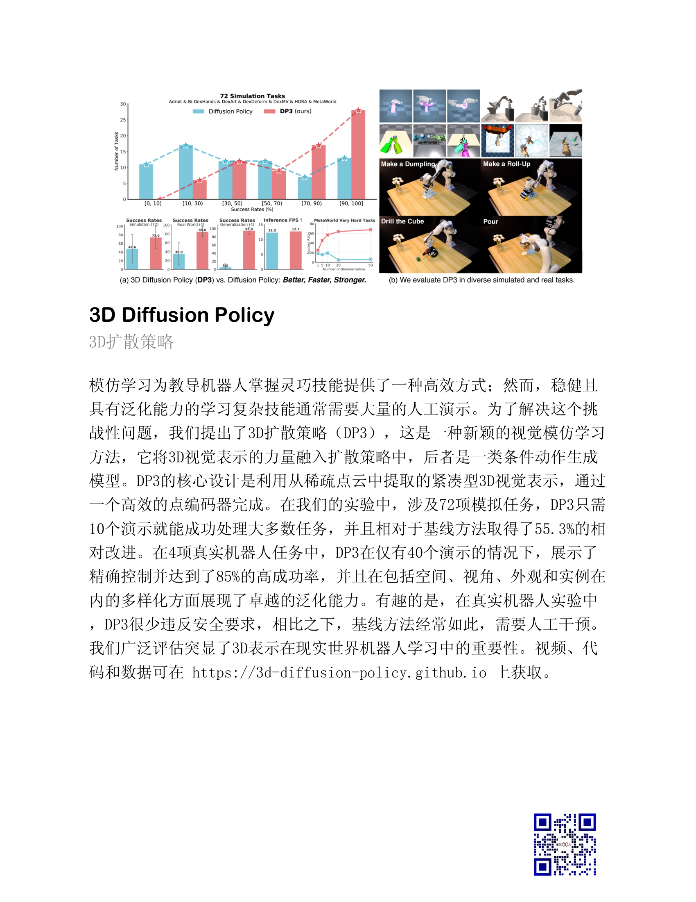

# DailyPaperPicAbstract
每日论文摘要图片版

## 安装依赖
python版本3.10
```shell
pip install -r requirements.txt
```

## 添加字体
将`file/fonts/`下的字体添加到`pythonxx/site-packages/reportlab/fonts`

## 使用方法
1. 添加智谱的api_key（zp_api_key）到环境变量
2. 运行`python main.py`

## 输出结果


